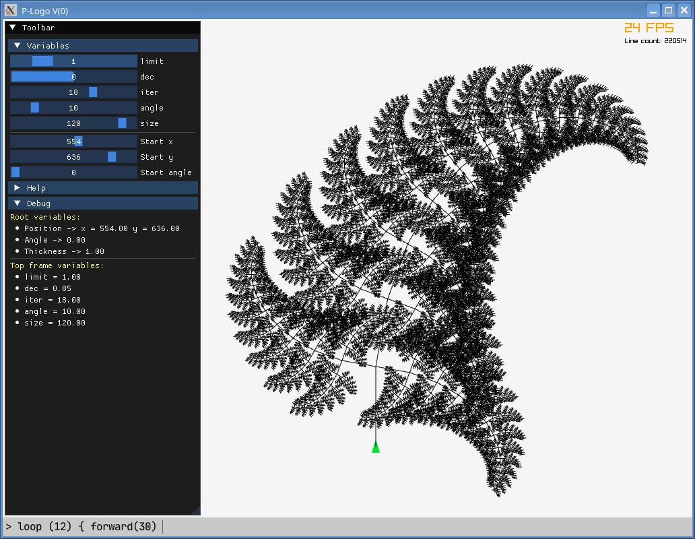

# P-Logo

## Use

- compile static version of [Raylib](https://github.com/raysan5/raylib/wiki/Working-on-GNU-Linux)
- fetch submodules (`git submodule init && git submodule update`)
- run tests `make clean && make test && ./test`
- compile: `make`
- run: `./main` or `./main <SOURCE>`

## Example

```
fn leaf(size, angle, iter, dec, limit) {
  x = getx()
  y = gety()
  oldangle = getangle()

  loop (iter) {
    f(size)
    r(angle)
    size = size * dec

    if (size > limit) {
      l(90)
      leaf(size * 0.5, angle, iter * 0.7, dec, limit)
      l(180)
      leaf(size * 0.5, angle, iter * 0.7, dec, limit)
      l(90)
    }
  }

  pos(x, y)
  angle(oldangle)
}

intvar("size", 10, 130, 120)
intvar("angle", 0, 60, 10)
intvar("iter", 2, 26, 18)
intvar("dec", 0.5, 1, 0.85)
intvar("limit", 0.5, 5, 1)

leaf(size, angle, iter, dec, limit)
```


