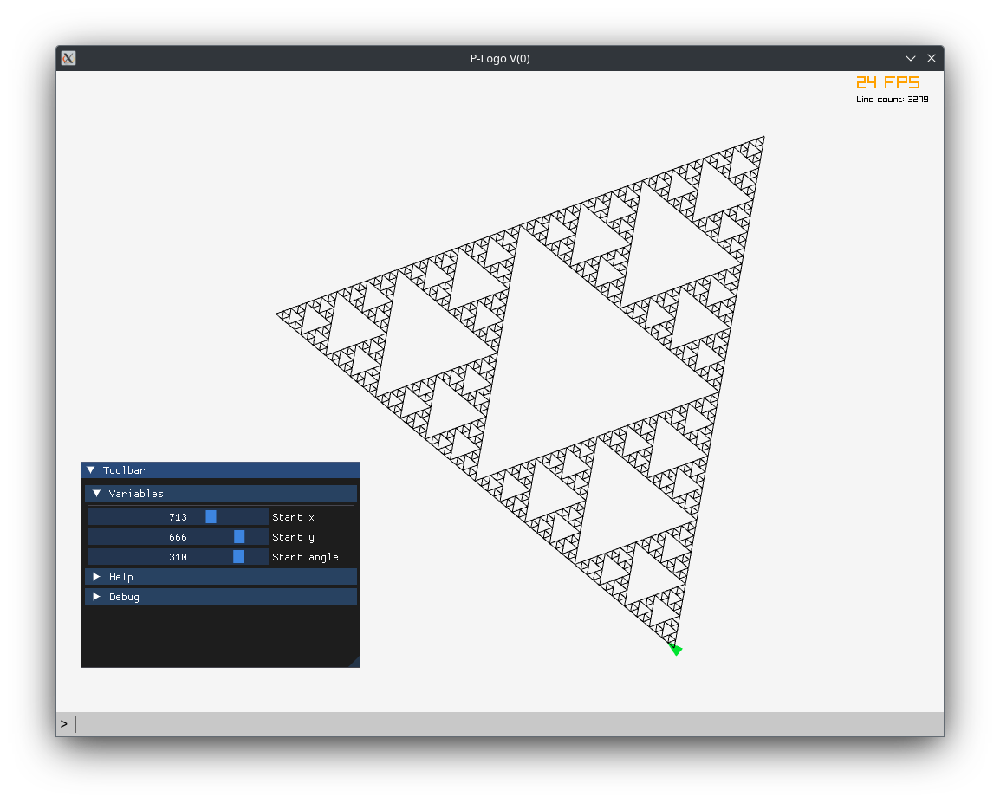

# P-Logo

## Use

- compile: `make`
- run: `./main` or `./main <SOURCE>`

## Commands

```
pos(<val>, <val>)

forward(<length>)
backward(<length>)

left(<angle>)
right(<angle>)

loop (<number>) {
}

if (<cond>) {
}

if (<cond>) {
} else {
}

fn <name>(<arg1>, <arg2>, ..) {
}

rand(<varname>, <min>, <max>)

intvar(<varname>, <min>, <max>, <default>)
```

## Example

```
fn triangle(size, limit) {
    loop (3) {
        if (size > limit) {
            triangle(size / 2, limit)
        }

        f(size)
        r(120)
    }
}

pos(200, 100)
r(90)
triangle(600, 10)
```



## Variables

Variable control UI can be obtained with `intvar`, eg: `intvar("size", 0, 200, 50)`.


